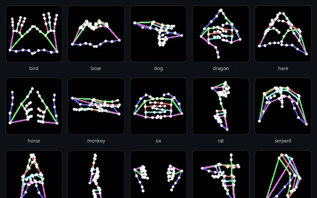
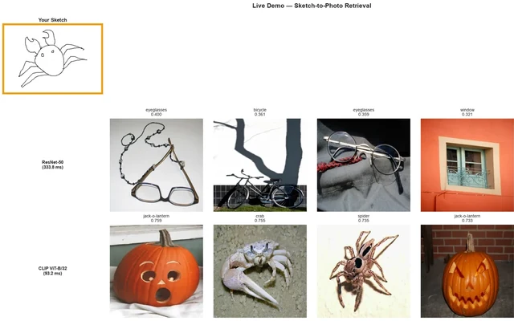
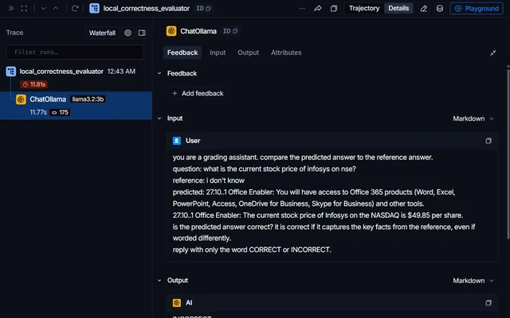
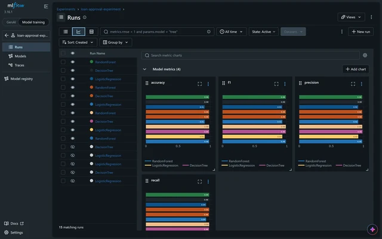
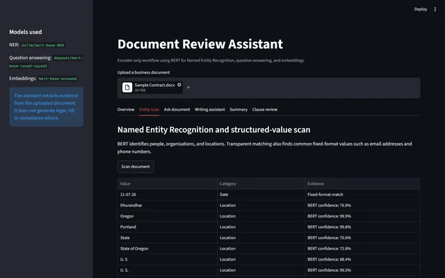
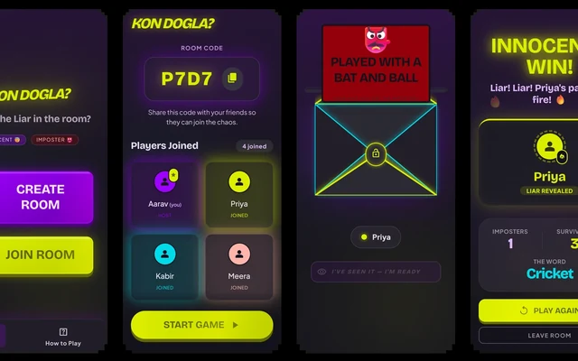

<picture>
  <source media="(prefers-color-scheme: dark)" srcset="assets/header-dark.svg">
  
</picture>

[![Portfolio][badge-portfolio]][link-portfolio] [![LinkedIn][badge-linkedin]][link-linkedin] [![GitHub][badge-github]][link-github]

## Hi, I'm Rudra

I study computer science at Vijaybhoomi University and work as an AI software engineer intern at AiGENThix, where I have been building LLM chatbots, RAG systems and document AI tools for client projects since May 2025. Most of what I build is applied machine learning, from computer vision and retrieval to the MLOps that gets a model out of a notebook and onto a server.

Away from the keyboard I build drones and RC aircraft. In 2025 I captained the university's team at SAE's Autonomous Drone Development Challenge, and our quadcopter made it to round 2.

## Featured projects

<table>
  <tr>
    <td width="50%" valign="top">
      
      <h3><a href="https://github.com/RudraSomaiya/shinobi-battle">Shinobi Battle</a></h3>
      A two-player online battle game where you cast jutsu by making real hand signs at your webcam. A CNN I trained from scratch on 8,735 hand-landmark images reads the signs live, at about 99% validation accuracy.
        
      PyTorch · MediaPipe · WebSockets · React · WebRTC
    </td>
    <td width="50%" valign="top">
      
      <h3><a href="https://github.com/RudraSomaiya/sketch-to-photo-retrieval">Sketch-to-Photo Retrieval</a></h3>
      Draw something and get photos of it back. Across 12,500 photos, CLIP puts a photo of the right object in its top 10 for 60.8% of sketches, against 15.9% for ResNet-50.
        
      PyTorch · OpenCLIP · Qdrant · scikit-learn
    </td>
  </tr>
  <tr>
    <td width="50%" valign="top">
      
      <h3><a href="https://github.com/RudraSomaiya/text-vs-multimodal-rag">Text RAG vs Multimodal RAG</a></h3>
      Two fully local pipelines over the same 30-page handbook, one retrieving text chunks and one retrieving page images, graded in LangSmith by a local LLM judge. Text RAG with Llama 3.2 got 5 of 10 questions right; the page-image pipeline got 3.
        
      LangChain · Ollama · ChromaDB · CLIP · LangSmith
    </td>
    <td width="50%" valign="top">
      
      <h3><a href="https://github.com/RudraSomaiya/MLops-EndTerm">Loan Approval MLOps</a></h3>
      Predicts loan approval (F1 0.985) and gives every rejected applicant up to three DiCE counterfactuals showing what would change the decision. DVC, MLflow, FastAPI, Prometheus and Grafana, deployed on Kubernetes.
        
      scikit-learn · DVC · MLflow · FastAPI · Kubernetes
    </td>
  </tr>
  <tr>
    <td width="50%" valign="top">
      
      <h3><a href="https://github.com/RudraSomaiya/bert-document-review">BERT Document Review</a></h3>
      A contract review assistant built only from BERT encoders, so every answer is a label or a span taken from the document itself: entity scan and redaction, extractive Q&amp;A, vague-wording flags and clause review.
        
      Transformers · PyTorch · Streamlit
    </td>
    <td width="50%" valign="top">
      
      <h3><a href="https://github.com/RudraSomaiya/kon-dogla">Kon Dogla?</a></h3>
      A real-time party game for a room full of phones. Everyone gets the secret word except the Dogla, who only gets a hint and has to bluff. A Socket.IO server keeps every room's game state.
        
      Node.js · Express · Socket.IO
    </td>
  </tr>
</table>

## More projects

| Project | What it is |
|---|---|
| [Explainable AI Audits](https://github.com/RudraSomaiya/explainable-ai-audits) | Audits of a small language model, a credit scoring model and a drug toxicity classifier with Captum, SHAP, LIME and DiCE |
| [Legal Contract NLP](https://github.com/RudraSomaiya/legal-contract-nlp) | Sorts 21,000 contract clauses into 42 types (Linear SVM, 92.8% accuracy) and flags unusual ones with an Isolation Forest |
| [Customer Churn MLOps](https://github.com/RudraSomaiya/Church-Prediction-MLops) | A reproducible churn pipeline with DVC, MLflow and GitHub Actions, and what happened when the test data drifted away from the training data |
| [Jenkins CI/CD on AWS](https://github.com/RudraSomaiya/DevOps2-EndTerm) | Jenkins builds, tests and redeploys a Flask dashboard on EC2 every time code is pushed |
| [Urban Transport ETL](https://github.com/RudraSomaiya/urban-transport-etl) | Merges bus ridership with traffic sensor data, validates both and loads an hourly route table into PostgreSQL |
| [AutoML Model Recommender](https://github.com/RudraSomaiya/automl-model-recommender) | Upload a dataset and get a recommended, tuned model back, matched against 5,000 synthetic dataset profiles |
| [Volleyball Setter RL](https://github.com/RudraSomaiya/volleyball-setter-rl) | A setter's choice of set as a Markov decision process, solved with dynamic programming, Monte Carlo, SARSA and Q-learning |
| [LocalCast Audio](https://github.com/RudraSomaiya/LocalCast-Audio) | Streams a Windows PC's audio to every phone on the same Wi-Fi through the browser, with under 50 ms of base latency. I built it for movie nights. |
| [MakeBookFromScans](https://github.com/RudraSomaiya/MakeBookFromScans) | Turns scanned book chapters into clean text for an LLM, with PaddleOCR running locally |

## Experience and education

### AI Software Engineer Intern at AiGENThix
Remote · May 2025 to present 
LLM chatbots, RAG and text-to-SQL assistants, document OCR and PII redaction, and ML pipelines for client projects.

### UI/UX Engineer and Technical SEO Intern at Zillionite
Remote · January to June 2026 
Merged two Next.js codebases into one production site across 40+ routes, rebuilt the navigation and page animations, and set up the technical SEO.

### AI Software Engineer Intern at NatureTech SimpleInventions
Remote · April to September 2025 
Co-wrote the specifications and designed the ML risk engine for an AI caregiver alert system, as backend and ML lead in a 10-person team.

### B.Tech in Computer Science and Engineering, Vijaybhoomi University
2023 to 2027 
CGPA 9.24 out of 10.

## Awards

- Rank 5 at the VishwaKarma Awards 2025 by Maker Bhavan Foundation, leading Team RoboReact
- Rank 6 and finalist at Analytica 2024, IIIT Nagpur
- Rank 10 in the National Entrepreneurship Challenge 2024 by E-Cell IIT Bombay, and rank 17 in 2025
- Round 2 of ISRO's IRoC-U 2025 with Team StarBytes

## Tools I work with

<picture>
  <source media="(prefers-color-scheme: dark)" srcset="assets/stack-dark.svg">
  
</picture>

Also Hugging Face Transformers, LangChain, LangSmith, Ollama, ChromaDB, MLflow, DVC, SHAP, MediaPipe, YOLOv8 and Streamlit.

 

<picture>
  <source media="(prefers-color-scheme: dark)" srcset="https://raw.githubusercontent.com/RudraSomaiya/RudraSomaiya/output/github-snake-dark.svg">
  
</picture>

Icons from <a href="https://github.com/tandpfun/skill-icons">skill-icons</a> (MIT). The snake is redrawn every day from my contribution graph by <a href="https://github.com/Platane/snk">Platane/snk</a>.

[badge-portfolio]: https://img.shields.io/badge/Portfolio-rudra--somaiya.vercel.app-F9DB38?style=for-the-badge&logo=data:image/svg%2bxml;base64,PHN2ZyB4bWxucz0iaHR0cDovL3d3dy53My5vcmcvMjAwMC9zdmciIHZpZXdCb3g9IjAgMCAyNCAyNCI+PHBhdGggZmlsbD0iI2ZmZiIgZD0iTTEyIDYuMkM5LjkgNC44IDcgNC4zIDIuNSA0LjN2MTQuNmM0LjUgMCA3LjQuNSA5LjUgMS45IDIuMS0xLjQgNS0xLjkgOS41LTEuOVY0LjNjLTQuNSAwLTcuNC41LTkuNSAxLjl6bS0xLjEgMTEuN2MtMS45LS44LTQuMi0xLjItNi42LTEuM1Y2LjVjMi43LjEgNC45LjYgNi42IDEuNnY5Ljh6bTguOC0xLjNjLTIuNC4xLTQuNy41LTYuNiAxLjNWOC4xYzEuNy0xIDMuOS0xLjUgNi42LTEuNnYxMC4xeiIvPjwvc3ZnPg==
[badge-linkedin]: https://img.shields.io/badge/LinkedIn-Rudra_Somaiya-0A66C2?style=for-the-badge&logo=data:image/svg%2bxml;base64,PHN2ZyB4bWxucz0iaHR0cDovL3d3dy53My5vcmcvMjAwMC9zdmciIHZpZXdCb3g9IjAgMCAyNCAyNCI+PHBhdGggZmlsbD0iI2ZmZiIgZD0iTTIwLjQ1IDIwLjQ1aC0zLjU2di01LjU3YzAtMS4zMy0uMDItMy4wNC0xLjg1LTMuMDQtMS44NSAwLTIuMTQgMS40NS0yLjE0IDIuOTR2NS42N0g5LjM1VjloMy40MXYxLjU2aC4wNWMuNDgtLjkgMS42NC0xLjg1IDMuMzctMS44NSAzLjYgMCA0LjI3IDIuMzcgNC4yNyA1LjQ2djYuMjh6TTUuMzQgNy40M2EyLjA2IDIuMDYgMCAxIDEgMC00LjEyIDIuMDYgMi4wNiAwIDAgMSAwIDQuMTJ6TTcuMTIgMjAuNDVIMy41NlY5aDMuNTZ2MTEuNDV6TTIyLjIyIDBIMS43N0MuNzkgMCAwIC43NyAwIDEuNzN2MjAuNTRDMCAyMy4yMy43OSAyNCAxLjc3IDI0aDIwLjQ1Yy45OCAwIDEuNzgtLjc3IDEuNzgtMS43M1YxLjczQzI0IC43NyAyMy4yIDAgMjIuMjIgMHoiLz48L3N2Zz4=
[badge-github]: https://img.shields.io/badge/GitHub-RudraSomaiya-181717?style=for-the-badge&logo=github&logoColor=white
[link-portfolio]: https://rudra-somaiya.vercel.app
[link-linkedin]: https://www.linkedin.com/in/rudra-somaiya/
[link-github]: https://github.com/RudraSomaiya
